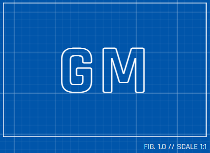

  

# Generative Manufacturing MCP Server

A Model Context Protocol (MCP) server that enables generative manufacturing workflows taking advantage of Gemini 3 and its capabilities. It integrates 3D model generation (OpenSCAD), slicing (PrusaSlicer), and printer management (Prusa Connect) with advanced AI.

It was built for the [Google Deepmind Gemini 3 Hackathon](https://gemini3.devpost.com/).

## Features

- **Generative Design**: Create and modify 3D models using natural language prompts with Gemini 3 and OpenSCAD.
- **Intelligent Slicing**: Slice models into G-code using PrusaSlicer intent profiles (draft, fast, strong, detail).
- **Printer Management**: Control Prusa printers (upload, start, pause, stop) and monitor status via Prusa Connect or local network.
- **AI Analysis**: Perform computer vision analysis on printer camera feeds to detect failures (spaghetti, warping, etc.) using Gemini 3 Vision.
- **Mock Mode**: Fully functional simulation mode for development and testing without physical hardware.

## Project Structure

This project consists of two main components:

1.  **[Generative Manufacturing Server](./generative-manufacturing-server/README.md)**: The core MCP server implementation.
2.  **[Demo Host](./demo-host/README.md)**: A web-based MCP host for interacting with the server.

## detailed Usage & Development

Please refer to the detailed READMEs in each directory for specific installation, usage, and development instructions:

-   👉 **[Server Documentation](./generative-manufacturing-server/README.md)** (Setup, Tools, Configuration)
-   👉 **[Host Documentation](./demo-host/README.md)** (Running the UI, Architecture)

# License & Attribution

The core of this system (located in generative-manufacturing-server) is original work licensed under the MIT License.

The demo infrastructure (located in demo-host) is based on the basic-host example provided in [MCP Apps Extension (SEP-1865)](https://github.com/modelcontextprotocol/ext-apps) and is included under the Apache 2.0 / MIT License. We have extended this MCP host by modifying to use our MCP server to demonstrate generative manufacturing. We have also modified the look of the tool and for the host to be able to run independently deployed for users to try and see the demo.

The MCP server utilizes OpenSCAD (GPLv2) for 3D generation. OpenSCAD is installed unmodified as a standalone utility and is executed via command-line interface.

The MCP server utilizes PrusaSlicer (AGPLv3) for 3D printing slicing. PrusaSlicer is installed unmodified as a standalone utility and is executed via command-line interface.

The Google Gemini logo belongs to Google and is only used here to indicate that this project was built for the Google Deepmind Gemini 3 Hackathon.